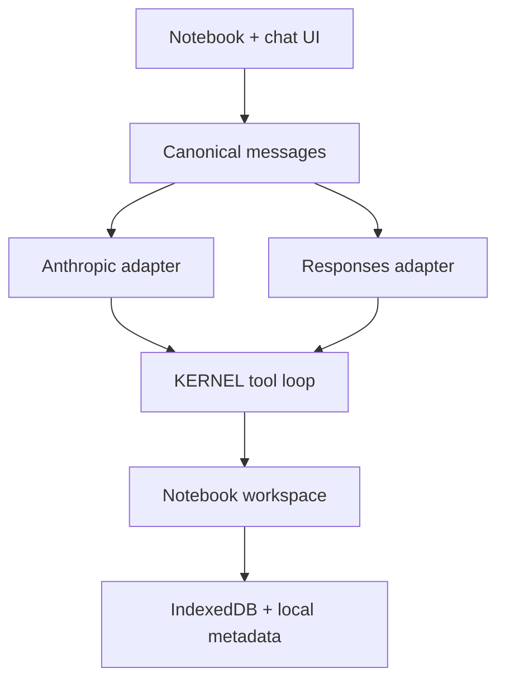

# KERNEL Agent v2 — Provider, Thread, Context, and Workspace Contract

Status: implemented on `feat/kernel-agent-v2` (September 2026).

This is the compatibility foundation retained by v2.3. The current durability, lineage,
artifact, checkpoint, comparison, and handoff contract is [`AGENT-V23-SPEC.md`](AGENT-V23-SPEC.md).

This remains the provider/thread foundation for `docs/kernel-agent.html` and
`docs/kernel-agent-mobile.html`. The original [`AGENT-SPEC.md`](AGENT-SPEC.md) still explains
the notebook tool contract and human-in-the-loop philosophy; this document superseded its
Anthropic-only, single-thread, and localStorage persistence assumptions.

## 1. Product invariants

1. **The notebook stays the source of truth.** The agent calls the same cell, execution,
   output, variable, and file functions the human uses.
2. **Provider changes do not change agent capabilities.** Anthropic, OpenAI, and xAI receive
   the same system instructions and tool schemas, and return one canonical internal message
   format.
3. **Full history is durable; active context is bounded.** Context preparation may summarize
   an outbound request, but it never mutates or deletes the saved thread.
4. **Notebooks are isolated workspaces.** A notebook owns its cells, outputs, files, results,
   and chat threads. Switching notebooks resets the Python namespace and mounts only the
   selected notebook's files.
5. **Standard notebooks remain standard.** `.ipynb` is the interoperable notebook format.
   `.kernel.zip` is the lossless KERNEL workspace format.
6. **Secrets do not travel.** API keys remain in browser storage and are excluded from
   notebooks, thread records, Markdown exports, and workspace ZIPs.
7. **Desktop and mobile run the same core.** Provider, persistence, context, and tool-loop
   code must be byte-identical between both builds.

## 2. Architecture



The provider boundary is narrow:

- translate canonical messages and tools to a provider request;
- parse the provider's SSE events into transcript updates and canonical assistant blocks;
- normalize token usage;
- preserve opaque continuation items that the provider requires on a later request.

Everything after that boundary—approvals, tool execution, notebook mutation, step limits,
stopping, persistence, and rendering—is shared.

## 3. Provider matrix

| Provider | API | Default base | Default model | Model discovery | Continuation detail |
|---|---|---|---|---|---|
| Anthropic | Messages | `https://api.anthropic.com` | `claude-sonnet-4-6` | `GET /v1/models?limit=1000`, following `after_id` pages | Native text/tool blocks and cache-control breakpoints |
| OpenAI | Responses | `https://api.openai.com/v1` | `gpt-5.6` | `GET /models` | Preserve reasoning output items, including encrypted continuation content; requests use `store: false` |
| xAI | Responses-compatible | `https://api.x.ai/v1` | `grok-4.6` | `GET /language-models`, falling back to `GET /models` | Same function-call loop as OpenAI; requests use `store: false` |

Default model IDs are editable, not hard allowlists. Discovery populates the browser-native
model picker from the authenticated provider response. A custom API base supports compatible
gateways. The context override exists because not every model-list response publishes a
context window and gateways may omit provider metadata.

### 3.1 Anthropic wire contract

The Anthropic adapter sends:

- `POST /v1/messages` with `stream: true`;
- system content as a stable skill block plus a live notebook-state block;
- native tools with `input_schema`;
- canonical text/image/tool-use/tool-result blocks mapped directly to Messages blocks;
- a cache breakpoint on the stable prompt/tool prefix.

It consumes `message_start`, `message_delta`, `content_block_start`,
`content_block_delta`, `content_block_stop`, and `error` events. Cache creation/read tokens
stay distinct from uncached input tokens.

### 3.2 OpenAI/xAI Responses wire contract

The shared Responses adapter sends:

- `POST /responses` with typed input items;
- `instructions` containing the same skill and live state as Anthropic;
- function tools (`type: function`, name, description, parameters);
- `stream: true`, `tool_choice: auto`, and `store: false`;
- an optional reasoning effort selected by the user.

Canonical tool calls map to `function_call`; tool results map to
`function_call_output`. User images and figure results map to `input_image` data URLs.
OpenAI requests ask for encrypted reasoning continuation content when reasoning is enabled.
Opaque reasoning output items are saved with their originating provider and replayed only to
that provider; switching providers still preserves ordinary text and tool history.

The adapter consumes typed Responses events, including output-text deltas, reasoning-summary
deltas, completion, failure, and error. The completed response is authoritative for canonical
output items and usage.

## 4. Canonical message model

Thread messages use alternating `user` and `assistant` records. Their content may contain:

| Block | Purpose |
|---|---|
| `text` | Human or assistant language |
| `image` | Base64 user image or tool-produced figure |
| `tool_use` | `{id, name, input}` independent of provider spelling |
| `tool_result` | `{tool_use_id, content[]}` with text and/or images |
| `reasoning` | A user-visible reasoning summary, rendered progressively |
| `provider_item` | Opaque same-provider continuation item, such as OpenAI encrypted reasoning |

Provider adapters must not leak their wire schema into the tool executor. Provider-specific
items are ignored when a thread is continued with another provider.

## 5. Token and context accounting

Each thread stores cumulative counters for:

- input tokens;
- output tokens;
- cached input tokens;
- Anthropic cache-write tokens;
- reasoning output tokens.

The chat footer exposes input and output totals. The context dialog shows full-history estimate,
active-payload estimate, provider/model limit, compaction status, cache tokens, and reasoning
tokens. Counters may be reset without modifying messages.

Context limit precedence is:

1. explicit user override;
2. authenticated model-discovery metadata;
3. a conservative provider/model-family fallback.

### 5.1 Compaction rule

The configured threshold defaults to 82% of the model context window.

1. Clone the full canonical history.
2. Replace old images and oversized historical tool payloads only in the clone.
3. Group messages into complete human turns so tool-call/result pairs remain valid.
4. If the estimate still exceeds the threshold, remove the oldest complete turns from the
   outbound clone and create a deterministic checkpoint containing their user goals, agent
   decisions, tool calls, and short results.
5. Add that checkpoint to the dynamic system instructions and send the remaining turns.
6. Keep the original `agMsgs`, transcript DOM record, and IndexedDB record unchanged.

The newest two turns are retained whenever possible. Every subsequent request recomputes the
active payload from the durable full thread and current notebook outline; a checkpoint is not
silently promoted into the saved conversation as if the model wrote it.

## 6. Threads

Every notebook has a small localStorage index:

```json
{
  "v": 2,
  "active": "t_…",
  "threads": [
    { "id": "t_…", "name": "Main thread", "created": 0, "updated": 0 }
  ]
}
```

Full records live in IndexedDB's `threads` object store under `<notebookId>:<threadId>`:

```json
{
  "notebookId": "nb_…",
  "id": "t_…",
  "name": "Main thread",
  "messages": [],
  "transcript": [],
  "usage": {},
  "provider": "openai",
  "model": "gpt-5.6"
}
```

The UI supports new, switch, rename, and delete. A notebook cannot lose its final thread.
Thread changes are blocked during a running agent turn. Writes are debounced while streaming
and forced before notebook switches, ZIP export, duplication, deletion, and import.

Legacy `kernel.agent.msgs.*`, `kernel.agent.tx.*`, and `kernel.agent.usage.*` records migrate
once into the first IndexedDB thread. They are read for migration only; v2 does not impose the
old 300-row/1.5 MB caps or strip images from the durable record.

## 7. Notebook workspace isolation

Notebook cell source/type/stable ID/collapse state remains in the existing local notebook
record. Large workspace state lives in IndexedDB's `workspaces` store:

- code-cell outputs, execution count, and runtime keyed by stable cell ID;
- mounted files as bytes plus name, media type, preview, and origin (`upload` or `result`).

On switch:

1. finish neither a user execution nor agent turn—switching is blocked until idle;
2. persist notebook, active thread, files, and outputs;
3. reset the Pyodide namespace and unmount tracked files;
4. load cells for the destination notebook;
5. restore only its outputs/files and active chat thread.

The live Python object graph is intentionally not serialized. Variables are recreated by
rerunning cells; serializing arbitrary Pyodide objects would be partial, surprising, and often
unsafe. The ZIP README states this explicitly.

Duplicating/forking preserves stable cell IDs because IDs are scoped by notebook. That keeps
saved outputs, action chips, and historical tool references attached to the corresponding
cloned cells.

## 8. Portable `.kernel.zip`

The archive uses ordinary ZIP headers and uncompressed entries, so it can be inspected by
standard ZIP tools while remaining dependency-free in the single-file app.

```text
manifest.json
notebook.ipynb
threads/<encoded-thread-id>.json
data/uploads/001-<name>
data/results/001-<name>
README.txt
```

`manifest.json` records format/version, export time, notebook name, active thread, thread
index, and file metadata. `notebook.ipynb` carries cells and rendered outputs. Thread JSON
carries every message, transcript entry, and usage counter. Filenames are sanitized on import,
entry CRCs are verified, and unsupported format versions fail closed.

The built-in reader intentionally accepts KERNEL's stored-entry archives only. A user may
inspect or repackage the archive externally, but KERNEL does not promise to import arbitrary
compressed ZIPs.

## 9. Rendering and workbench surfaces

- Assistant text uses the notebook Markdown renderer while streaming. An unmatched live code
  fence is closed for preview and the final message is re-rendered/type-set on completion.
- Reasoning summaries render in a collapsed `<details>` disclosure separate from the answer.
- Action chips remain HTML-controlled UI and are not interpreted as model Markdown.
- Moving outputs between inline cells and the output panel moves the existing output DOM node;
  rich HTML, iframes, and figures are not rebuilt.
- The Variables panel sorts by name, type, or measured memory bytes and refreshes explicitly.
- The Data panel groups user uploads and agent results.

## 10. Security and privacy

- Keys are password inputs persisted only in the per-provider browser configuration.
- Exports never read that configuration.
- Responses calls explicitly set `store: false`; this is an API request preference, not a
  claim about all provider telemetry or retention policies.
- Custom API bases are powerful: users must choose gateways they trust.
- Model output Markdown uses KERNEL's existing sanitizing renderer. Tool action chips are built
  by app code, not raw model HTML.
- Existing sandboxing for interactive notebook output remains unchanged.

## 11. Acceptance gates

`node tests/verify_agent_v2.mjs` must pass. It checks:

- every inline script parses;
- desktop/mobile shared runtime equality;
- all three providers and both wire adapters exist;
- Responses storage is disabled and reasoning continuation is present;
- threads, usage fields, context checkpointing, Markdown rendering, stable IDs, and ZIP
  workspace markers are present;
- old lossy transcript/message caps are absent;
- a Unicode/binary ZIP fixture round-trips with valid CRCs.

`node scripts/sync_agent_builds.mjs` updates the mobile build from the desktop source before
verification. Provider live calls require user-owned keys and are not part of repository CI.

## 12. Official API references used

Checked September 3, 2026:

- [OpenAI: migrate to the Responses API](https://developers.openai.com/api/docs/guides/migrate-to-responses)
- [OpenAI: function calling](https://developers.openai.com/api/docs/guides/function-calling)
- [OpenAI: reasoning models](https://developers.openai.com/api/docs/guides/reasoning)
- [OpenAI API reference](https://developers.openai.com/api/reference/python)
- [Anthropic model overview](https://platform.claude.com/docs/en/models/overview)
- [Anthropic streaming Messages](https://platform.claude.com/docs/en/build-with-claude/streaming)
- [Anthropic context windows](https://platform.claude.com/docs/en/build-with-claude/context-windows)
- [xAI API overview](https://docs.x.ai/overview)
- [xAI text generation / Responses compatibility](https://docs.x.ai/developers/model-capabilities/text/generate-text)
- [xAI Models API](https://docs.x.ai/developers/rest-api-reference/inference/models)
- [xAI tools overview](https://docs.x.ai/developers/tools/overview)
