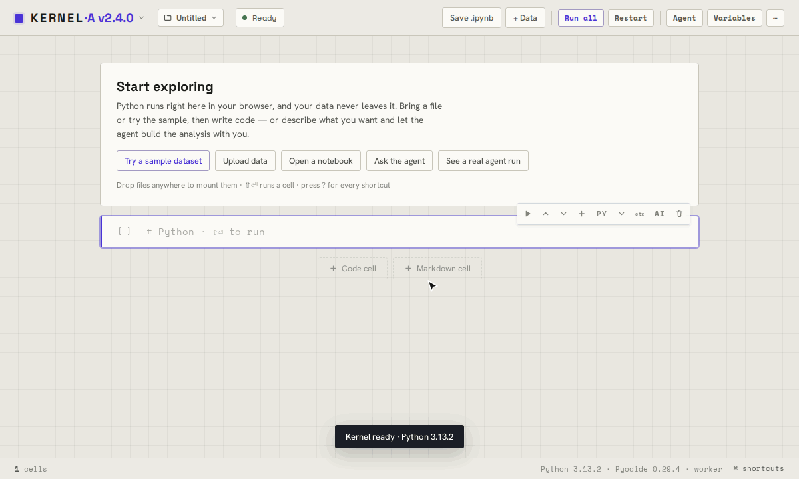

<div align="center">

# KERNEL

**A Python notebook in one HTML file, with an agent that writes, runs and checks the analysis with you.**

No install, no server, no account. Python runs in your browser through Pyodide, and your data stays there.

<a href="https://dogum.github.io/kernel/kernel-agent.html"></a>

[](https://github.com/dogum/kernel/actions/workflows/verify.yml)
[](LICENSE)

**[Open KERNEL·A](https://dogum.github.io/kernel/kernel-agent.html)** · **[KERNEL without the agent](https://dogum.github.io/kernel/kernel.html)** · **[On your phone](https://dogum.github.io/kernel/kernel-agent-mobile.html)** · **[Real agent runs](#real-agent-runs)** · **[Changelog](CHANGELOG.md)**

</div>

---

| | What it is |
|---|---|
| **KERNEL** · [`docs/kernel.html`](docs/kernel.html) | The notebook: Python and markdown cells, plots, interactive Plotly, DataFrames, KaTeX, Mermaid, a data workspace, a variable inspector, and `.ipynb` round-trip. |
| **KERNEL·A** · [`docs/kernel-agent.html`](docs/kernel-agent.html) | The notebook with a bring-your-own-key agent (Anthropic, OpenAI, xAI) that plans, writes and runs cells, sees text and figures, and recovers safely after interruption. |
| **KERNEL·M** · [`docs/kernel-agent-mobile.html`](docs/kernel-agent-mobile.html) | KERNEL·A for phones: bottom sheets and a tab bar, installable, and offline after the first load. |
| **`kernel-notebooks`** · [`skill/`](skill/) | A Claude skill for writing notebooks that make the most of this runtime. |

## Real agent runs

Four unedited runs, with their prompts, decisions, corrections and rough edges kept. **Open in KERNEL·A** loads the notebook with the outputs the run produced; nothing runs until you ask.

| Run | What the agent did | |
|---|---|---|
| [Fleet electrification](examples/fleet-dna/) | Real, wide public data on commercial-vehicle duty cycles: data-quality forensics, leakage-safe modeling, three duty-cycle archetypes | [Open in KERNEL·A](https://dogum.github.io/kernel/kernel-agent.html?example=fleet-dna) |
| [Regex engine](examples/regex-engine/) | A from-scratch NFA/DFA engine, three repaired semantic bugs, 20,000 consecutive agreements with Python `re.fullmatch` | [Open in KERNEL·A](https://dogum.github.io/kernel/kernel-agent.html?example=regex-engine) |
| [Lunar settlement launches](examples/lunar-settlement/) | A bottom-up launch model with explicit assumptions: baseline 121 launches, P10/P50/P90 of 112/134/161 | [Open in KERNEL·A](https://dogum.github.io/kernel/kernel-agent.html?example=lunar-settlement) |
| [Ares Station operations](examples/ares-station/) | A 4,320-hour colony twin, seven diagnosed incidents, a maintenance model and a stress-tested operating policy | [Open in KERNEL·A](https://dogum.github.io/kernel/kernel-agent.html?example=ares-station) |

They were captured with KERNEL Agent 2.3.0. The published notebooks keep the visible cells and outputs, and drop the private chat and provider metadata, run identifiers and checkpoint duplicates. [`examples/`](examples/) has each run's prompt, usage and limitations.

## Use it

**The apps** are single HTML files. Open them from the [live page](https://dogum.github.io/kernel/), download one from [`docs/`](docs/) and open it locally, or put it on any static host. Pyodide downloads about 10 MB on first run and is cached after. Installing KERNEL·M to a home screen and using it offline need https, which GitHub Pages provides.

**The agent** needs an API key from Anthropic, OpenAI, or xAI; add it in the agent's settings. Keys stay in your browser and requests go straight to the provider (or a compatible gateway you choose).

**The skill:** in Claude.ai, download [`kernel-notebooks.skill`](https://dogum.github.io/kernel/kernel-notebooks.skill) and upload it under Settings → Capabilities → Skills. In Claude Code, copy the folder:

```bash
git clone https://github.com/dogum/kernel.git
cp -r kernel/skill ~/.claude/skills/kernel-notebooks
```

## What the agent does

- **Works in the notebook like you would.** It writes markdown and code cells, runs them, reads text, tables and figures, and fixes what breaks. You can paste or drop images into the chat, and every cell has an *ai* button that hands it to the agent.
- **Runs you can trust.** Every run is durable: it has a visible plan, budgets, pause and resume, and recovery after a reload. A run that used tools finishes only when its plan is done and a `finish_run` check confirms the evidence. AUTO runs freely with a Stop button; STEP asks before each run.
- **Checkpoints and forks.** Restore a notebook to any checkpoint, or fork a new notebook from it without touching the original.
- **Cheap and resilient.** Prompts stay stable enough for provider caching, budgets count cache reads at their real cost, and rate limits, overloads and dropped streams retry automatically.
- **Python that never freezes the page.** Pyodide runs in a worker. Interrupt a cell from the toolbar or with `i i`, and agent-run cells have a time limit.
- **Knows what is stale.** KERNEL tracks dependencies between cells and files, marks outputs as fresh, stale or historical, and links tracebacks to the cell and line.
- **Your files and context, under your control.** Uploads and results get stable IDs, previews and provenance. You can pin or exclude cells and files from the agent's context and see every token it uses.
- **Portable.** A `.kernel.zip` carries the notebook, outputs, threads, files, runs and checkpoints to another browser. A share-safe export strips history and keeps only approved results.
- **Several threads per notebook, and model comparison.** Send one question to up to six provider and model setups and compare the answers side by side.
- **Built for exploring.** It includes a sample dataset and drop-anywhere file mounting. The variable inspector adds cells in one click: head, describe, missing values, correlations, value counts, histograms. You can copy or download tables and figures, and *Fix with agent* appears on errors. Destructive actions offer Undo.

Claude Opus 5.5 is the default model, with adaptive thinking. The design and every contract are in [`specs/`](specs/).

## Privacy

The notebook is client-side: Python runs in your browser, and your code and data leave the page only when you use the agent. The agent sends the context you allow straight to the provider or gateway you chose, with a key stored in this browser; OpenAI and xAI requests ask the provider not to store responses. Exports never include keys or provider settings. A full workspace export is lossless, so it keeps your prompts, cells and files as they are; check a share-safe export's redaction report before passing it on.

## Repository

| Folder | Holds |
|---|---|
| [`docs/`](docs/) | The GitHub Pages site: the three apps, the landing page, the service worker, and the packaged skill. |
| [`src/`](src/README.md) | Source of the two agent pages, built into `docs/` by `scripts/build.mjs`. |
| [`specs/`](specs/) | The agent's design and contracts. |
| [`skill/`](skill/) | The `kernel-notebooks` Claude skill. |
| [`examples/`](examples/) | The curated agent runs above. |
| [`tests/`](tests/) | Static and fixture checks, and browser tests that drive both builds against a mock model. |

[`.github/CONTRIBUTING.md`](.github/CONTRIBUTING.md) has the commands to run before a PR and how releases work. Changes are in [`CHANGELOG.md`](CHANGELOG.md).

## License

Apache 2.0. See [`LICENSE`](LICENSE).
