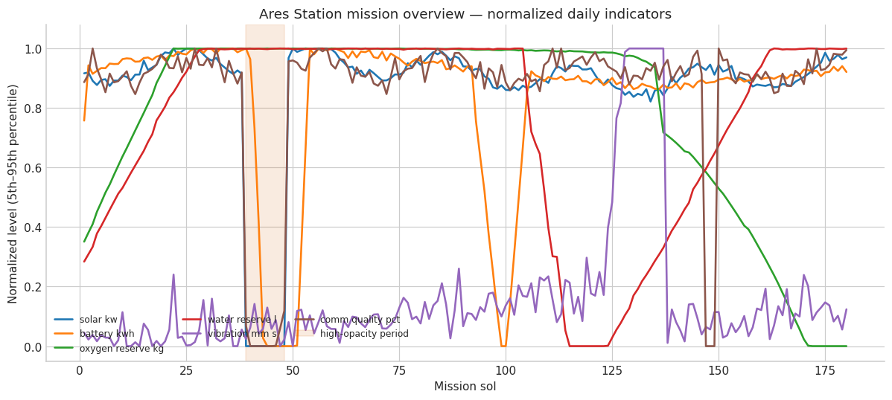

# Ares Station Operations Intelligence

An intentionally oversized blank-notebook challenge: generate a coherent 180-sol Mars-colony digital twin, rediscover its hidden failures as an analyst, forecast resource risk, optimize operations, pressure-test the policy, and finish with a commander-ready report.

## Outcome

The agent built 4,320 hourly observations spanning power, batteries, oxygen, water, greenhouse production, environment, equipment, communications, and crew activity. It diagnosed seven operational incidents, built a time-aware predictive-maintenance model with 0.877 held-out average precision, forecast oxygen crossing its critical threshold in about 213 hours, and revised an initially fragile operating plan.

Across the final 800-scenario stress test, the adaptive buffered policy reduced battery-floor violations from 59.6% to 0.0% and oxygen-floor violations from 83.9% to 1.4%. The notebook also records three material corrections: an infeasible calibration, a missing optimization variable, and an invalid lead-time interpretation.

## Run card

| Field | Captured value |
|---|---|
| Captured | 2026-09-03 |
| Runtime | KERNEL Agent 2.3.0; Pyodide 0.29.4; Python 3.13.2 |
| Provider / model | OpenAI / `gpt-5.6-sol` |
| Durable runs | 1 completed run |
| Notebook | 53 cells: 27 code, 26 Markdown |
| Evidence | 53 output blocks, 12 figures, 0 final error outputs |
| Agent loop | 65 tool calls, 64 model calls, 10.4 active minutes |
| Provider usage | 1,898,646 input; 35,660 output; 48,045 cached; 7,654 reasoning tokens |

## Files

- [`prompt.md`](prompt.md) — exact challenge prompt
- [`result.ipynb`](result.ipynb) — curated, self-contained notebook result
- [`figures/mission-overview.png`](figures/mission-overview.png) — one of 12 rendered figures

This run did not register separate final files, so the notebook itself is the complete recovered result.

## Read it honestly

All operational data are synthetic and the reported mission outcomes are demonstrations, not evidence about an actual Mars settlement. The value of the example is the long autonomous workflow: linked simulation, empirical inspection, error repair, time-aware validation, constrained optimization, scenario testing, and a final Markdown decision brief.
