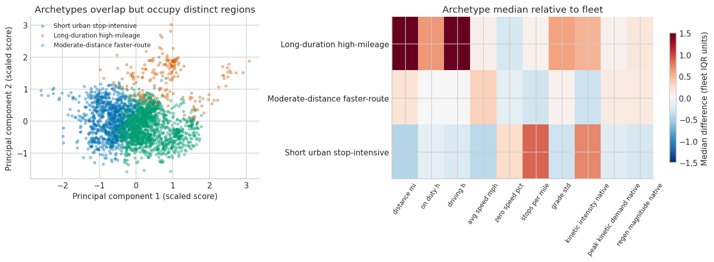

# Fleet DNA Duty-Cycle Electrification

The real-data example. Starting from a 4,705-row × 372-column public vehicle-day table plus a 28-page data dictionary, the agent had to establish grain and units, audit a wide and imperfect schema, avoid vehicle leakage, pressure-test its clustering, build a transparent electrification screen, and select actual—not synthetic—engineering cases.

## Outcome

The analysis covers 486 vehicles across 57 deployments and 20 providers. It found material quality problems rather than smoothing them away: 3,140 days had collection ratio below 0.5, 3,518 contained a gap over one hour, 262 contained negative stop-duration statistics, and several fields were constants, duplicates, or mislabeled.

An initial six-cluster solution looked stable under ordinary resampling but changed sharply on higher-coverage days (ARI 0.41). The agent responded by redefining the primary archetypes on the high-coverage subset. The final three-cluster definition had mean vehicle-resampled ARI 0.90, while full-data versus high-coverage assignments still agreed only moderately (ARI 0.48)—a limitation carried into the conclusions.

The result identifies short urban stop-intensive, long-duration high-mileage, and moderate-distance faster-route profiles; selects ten actual `(vid, day_id)` cases spanning medoids and operational extremes; and reaches 0.71 grouped out-of-vehicle balanced accuracy and macro F1 on nine adequately supported vocations. Its electrification result is explicitly a comparative screen: short urban days are most compatible with the stated scenarios, while long high-mileage days are least compatible and most assumption-sensitive.

## Run card

| Field | Captured value |
|---|---|
| Captured | 2026-09-04 |
| Runtime | KERNEL Agent 2.3.0; Pyodide 0.29.4; Python 3.13.2 |
| Provider / model | OpenAI / `gpt-5.6-sol` |
| Notebook | 61 cells: 50 code, 11 Markdown |
| Evidence | 76 output blocks, 5 figures, 0 final error outputs; true Markdown final cell |
| Provider usage | 3,700,568 input; 34,240 output; 142,857 cached; 6,909 reasoning tokens |
| Recovery | Notebook saved; full workspace ZIP failed during browser buffer allocation |

## Files

- [`prompt.md`](prompt.md) — exact challenge prompt
- [`result.ipynb`](result.ipynb) — curated notebook result
- [`SOURCE.md`](SOURCE.md) — official source, hashes, license, citation, and rerun instructions
- [`figures/archetypes.png`](figures/archetypes.png) — representative archetype figure

The original run registered six final files, but their payloads lived in the workspace archive that failed before download. Their generating cells and declared filenames remain in the notebook. Reconstructed local copies were not substituted for the originals because three of six differed under a newer local scientific-Python stack.

## Curation note

The saved `.ipynb` was enough to preserve the complete analytical journey and visible results. Private thread/provider metadata was removed, and several cells that printed long verbatim excerpts from the third-party data dictionary now contain an explicit curation notice. Analytical outputs, plots, code, corrections, and the final Markdown findings cell remain.

## Read it honestly

The source observations are historical and cannot establish current fleet adoption or present-day battery performance. Vehicle class midpoint is a mass proxy, several energy-model parameters are assumptions, and sparse vocations are not presented as well-validated. The strongest limitation—sampling completeness changing cluster boundaries—is treated as a result, not a footnote.
