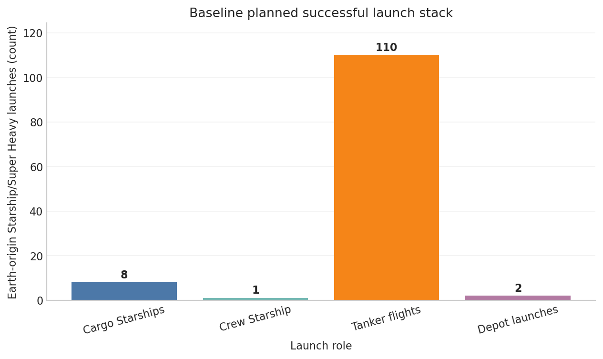

# Lunar South-Pole Settlement Launch Model

A decision-modeling challenge that forces a bottom-up settlement mass budget, an explicit Starship/tanker/depot transport model, integer launch arithmetic, a flight-level cargo manifest, scenario corners, Monte Carlo uncertainty, sensitivity analysis, and automated invariants.

## Outcome

The model's baseline is **121 planned successful Starship/Super Heavy launches**:

`8 cargo + 1 crew + 110 tanker + 2 depot = 121`

The seeded 20,000-case analysis reports P10/P50/P90 of **112/134/161** launches. The resilient mass budget delivers 811.1 t; strict 180-day and 30-day-reserve cases happen to remain on the same integer launch count at the baseline assumptions. Compounded optimistic and conservative corners span 56–357, illustrating why the distribution and assumption registry matter more than a single headline.

## Run card

| Field | Captured value |
|---|---|
| Captured | 2026-09-04 |
| Runtime | KERNEL Agent 2.3.0; Pyodide 0.29.4; Python 3.13.2 |
| Provider / model | OpenAI / `gpt-5.6-sol` |
| Durable runs | 1 completed run |
| Notebook | 19 cells: 13 code, 6 Markdown |
| Evidence | 29 output blocks, 4 figures, 0 final error outputs |
| Agent loop | 44 tool calls, 38 model calls, 6.1 active minutes |
| Provider usage | 930,222 input; 27,131 output; 7,192 cached; 5,537 reasoning tokens |

## Files

- [`prompt.md`](prompt.md) — exact challenge prompt
- [`result.ipynb`](result.ipynb) — curated notebook result
- [`artifacts/ASSUMPTIONS.csv`](artifacts/ASSUMPTIONS.csv) — low/base/high registry with rationale and status
- [`artifacts/LAUNCH_MANIFEST.csv`](artifacts/LAUNCH_MANIFEST.csv) — flight-level cargo packing
- [`artifacts/lunar_settlement_model.py`](artifacts/lunar_settlement_model.py) — standalone model
- [`artifacts/REPORT.md`](artifacts/REPORT.md) — decision report
- [`artifacts/`](artifacts/) — the original CSVs, model, report, and all four linked figures as one intact bundle

## Read it honestly

The answer is an assumption-driven architecture model, not a forecast or a verified Starship performance claim. Surface payload, net tanker delivery, lunar-ship propellant, transfer losses, boiloff, and depot behavior are visible uncertain inputs. The two largest drivers each move the total by more than 40 launches across their registered bounds. The baseline counts planned successful launches; it does not quietly conflate them with expected attempts under launch failure.
