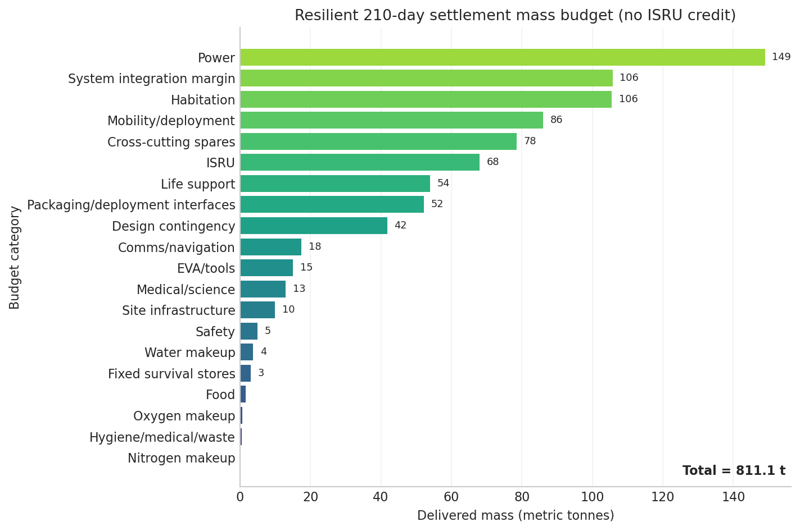
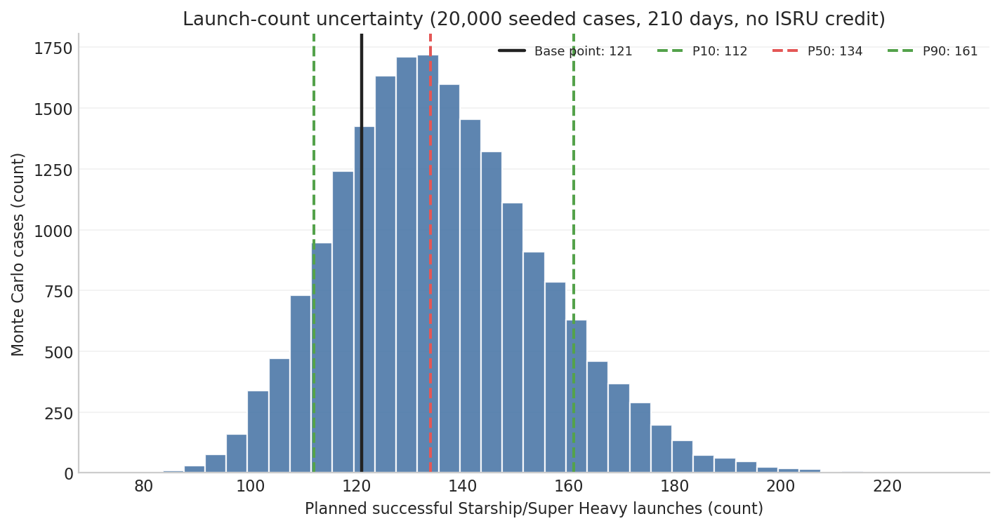
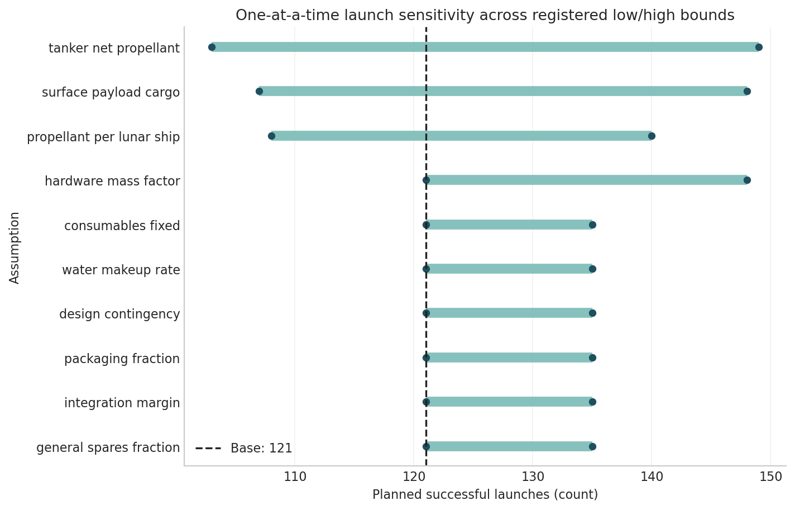

# Lunar south-pole settlement launch estimate

> **Baseline: 121 successful Starship launches = 9 cargo/crew Starships + 110 tanker flights + 2 depot launches. Plausible range: 112–161.**

The decision baseline is four people for 210 days (180 plus 30 reserve) with **no ISRU survival credit**. It uses 8 cargo Starships and 1 crew Starship. There is no non-Starship launch dependency, so the Starship and all-launch-vehicle totals are both 121.

## Launch arithmetic

- Settlement inventory: **811.1 t** delivered.
- Lunar-bound vehicles: **8 cargo + 1 crew = 9**.
- Depot throughput per lunar vehicle: **1527 t**, including assumed reserve, loss, and boiloff.
- Tankers: `ceil(9 × 1527.3 / 125) = 110`.
- Depots: max(capacity requirement, reuse-cycle requirement) = **2**.
- Total: `8 + 1 + 110 + 2 = 121` planned successful launches.

## Infrastructure-only and crew-inclusive

- Infrastructure-only all-cargo build: **121 = 9 cargo + 110 tanker + 2 depot**.
- Crew-inclusive: **121 = 8 cargo + 1 crew + 110 tanker + 2 depot**.
- The crew vehicle substitutes for one cargo vehicle and carries 12.6 t of inventory.

## Strict 180-day and reserve results

| mission case | delivered mass t | cargo | crew | tankers | depots | total |
| --- | --- | --- | --- | --- | --- | --- |
| strict 180-day | 809.9 | 8 | 1 | 110 | 2 | 121 |
| 180 + 30 reserve | 811.1 | 8 | 1 | 110 | 2 | 121 |

The 30 extra days add 1.2 t but do not cross a launch boundary.

## ISRU policies

| case | ISRU policy | delivered mass t | consumables t |
| --- | --- | --- | --- |
| Strict 180-day | no_credit | 809.95 | 8.72 |
| Strict 180-day | partial | 808.35 | 7.44 |
| Strict 180-day | mature | 806.76 | 6.15 |
| 180 + 30-day reserve | no_credit | 811.13 | 9.67 |
| 180 + 30-day reserve | partial | 809.14 | 8.07 |
| 180 + 30-day reserve | mature | 807.31 | 6.59 |

Partial credit starts after day 60 at 50% water/oxygen replacement; mature credit starts after day 30 at 80%. No policy credits food, nitrogen, hygiene/medical, fixed contingency, or pre-commissioning stores. The headline uses no credit.

## Conservative, baseline, and optimistic corners

| scenario | ISRU policy | delivered mass t | cargo | crew | tankers | depots | total |
| --- | --- | --- | --- | --- | --- | --- | --- |
| conservative | no_credit | 1150.0 | 15 | 1 | 335 | 6 | 357 |
| baseline | no_credit | 811.1 | 8 | 1 | 110 | 2 | 121 |
| optimistic | mature | 622.8 | 5 | 1 | 49 | 1 | 56 |

Corners compound all bounds and are not percentiles. The seeded 20,000-case no-credit Monte Carlo gives **P10/P50/P90 = 112/134/161**; 112–161 is the stated plausible range.

## Top five drivers

| parameter | low total | base total | high total | range launches | Spearman rho |
| --- | --- | --- | --- | --- | --- |
| tanker_net_propellant | 149 | 121 | 103 | 46 | -0.53 |
| surface_payload_cargo | 148 | 121 | 107 | 41 | -0.53 |
| propellant_per_lunar_ship | 108 | 121 | 140 | 32 | 0.37 |
| hardware_mass_factor | 121 | 121 | 148 | 27 | 0.36 |
| general_spares_fraction | 121 | 121 | 135 | 14 | 0.13 |

Evidence that would most reduce uncertainty:

1. Repeated demonstration of net tanker propellant delivered after transfer losses.
2. A closed lunar-landing design for usable surface payload and unloading interfaces.
3. Trajectory/reserve closure for propellant required per lunar-bound Starship.
4. Mass-mature power, habitation, mobility, and ISRU designs.
5. Reliability evidence supporting narrower spares and depot-reuse assumptions.

## Resilience basis

The inventory includes two isolatable habitats, duplicate airlocks, 2+1 life-support and water trains, dual emergency power, sectional solar/batteries, redundant communications, six suits, duplicate ISRU/feedstock equipment, rescue mobility, deployment machinery, workshops, medical caches, and explicit contingency, spares, packaging, and integration layers. These are conceptual allowances, not certified designs.

## Planned successes versus expected attempts

The headline is **planned successful launches**. As a separate illustration only, independent 97% success on every attempt implies `121 / 0.97 = 124.7` expected attempts. It is not added to the plan or Monte Carlo and does not represent correlated-failure risk.

## Dominant caveat and verification

No Starship performance input is claimed as verified. Tanker delivery and lunar payload dominate and each moves the answer by more than 40 launches across its registered range. This is an architecture-scale estimate, not a flight-certified manifest.

All 8 automated checks pass: mass reconciliation, flight capacity, category sum, payload monotonicity, crew-size and duration monotonicity, no propellant/cargo double count, and complete infrastructure-only inventory.
