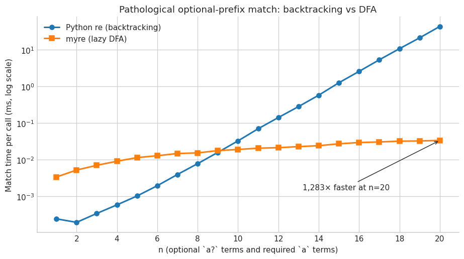

# Regex Engine by Differential Testing

This challenge asks the agent to build a regular-expression engine without using a regex implementation, then continuously compare it with Python's `re.fullmatch`, minimize mismatches, repair itself, and prove a 20,000-case agreement gate.

## Outcome

The finished [`myre.py`](artifacts/myre.py) contains a tokenizer, recursive-descent parser, AST, Thompson NFA construction, and lazy subset-DFA execution. The test campaign found and repaired three real semantic bugs:

1. A character-class range used an exclusive upper bound.
2. Dot incorrectly matched a newline.
3. `$` did not match immediately before a terminal newline under Python's default semantics.

The final seeded campaign produced 20,000 consecutive agreements—11,324 matching cases and 8,676 nonmatching cases. On the requested pathological case at `n = 20`, the report records approximately 43.1 ms for Python `re` and 0.0336 ms for `myre`, about 1,283× faster for that deliberately adversarial input.

## Run card

| Field | Captured value |
|---|---|
| Captured | 2026-09-03 |
| Runtime | KERNEL Agent 2.3.0; Pyodide 0.29.4; Python 3.13.2 |
| Provider / model | OpenAI / `gpt-5.6-sol` |
| Durable runs | 2 completed runs; one manual continuation |
| Notebook | 70 cells: 34 code, 36 Markdown |
| Evidence | 52 output blocks, 2 figures, 0 final error outputs |
| Agent loop | 92 tool calls, 91 model calls, 13.0 active minutes |
| Provider usage | 2,909,744 input; 37,409 output; 75,957 cached; 13,025 reasoning tokens |

## Files

- [`prompt.md`](prompt.md) — exact initial challenge
- [`continuation.md`](continuation.md) — exact instruction used to resume the interrupted work
- [`result.ipynb`](result.ipynb) — curated notebook result
- [`artifacts/myre.py`](artifacts/myre.py) — original final engine
- [`artifacts/REPORT.md`](artifacts/REPORT.md) — original final engineering report

## Read it honestly

The first run stopped after incorrectly claiming an execution-time limit, even though its ledger had not exhausted that limit. The short continuation prompt resumed the preserved state and completed every phase. That failure is part of the example because it directly motivated KERNEL 2.3.1's completion-safe autonomy.

The last cell is code that verifies and prints `REPORT.md`; printed Markdown remains a code output rather than a true Markdown cell. The notebook preserves that presentation edge instead of quietly rewriting history. `myre` implements the challenge's bounded grammar, not Python's complete regular-expression language; the report lists unsupported features.
