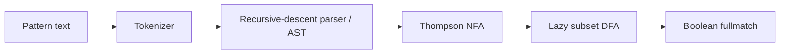

# Regex Engine Build and Differential-Test Report

## Executive summary

`myre.py` is a from-scratch regular-expression engine with a tokenizer, recursive-descent parser, AST, Thompson NFA construction, and lazy subset construction to a DFA. Its implementation imports no regex library. Three semantic defects were discovered and repaired. The final seeded mixed campaign produced **20,000 consecutive agreements** with Python `re.fullmatch`: 11,324 matches and 8,676 nonmatches.

## Environment

| Capability | Available | Observed detail |
|---|---:|---|
| Python | yes | 3.13.2 (main, May  7 2026, 08:28:34) [Clang 21.0.0git (https:/github.com/llvm/llvm-project 2f05451198e2f222ec66cec489 |
| Platform | yes | emscripten |
| Recursion limit | yes | 3000 |
| numpy | yes after micropip | 2.2.5; initial direct import failed |
| matplotlib | yes after micropip | 3.8.4; initial direct import failed |
| scipy | yes after micropip | 1.14.1; initial direct import failed |
| sympy | yes after micropip | 1.13.3; initial direct import failed |
| micropip | yes | 0.11.1; install callable and fallback install succeeded |
| Filesystem | yes | write/read/delete round trip in /home/pyodide |
| Threading | module only | Thread.start raised RuntimeError: can't start new thread |
| Multiprocessing | module only | Process.start reached os.fork then OSError 52: Function not implemented |
| Socket | object only | AF_INET/SOCK_STREAM create/close succeeded; connectivity not claimed |
| Integer loop | single core | 2,000,000 iterations in 0.3092 s; about 6,468,305 iterations/s |

All implementation, testing, and benchmarking remained single-threaded because actual thread and process startup failed empirically.

## Architecture

- **Tokenizer:** emits literals, dot, postfix quantifiers, alternation, parentheses, classes, escapes, and anchors.
- **Parser:** applies alternation, concatenation, and postfix precedence and accepts empty alternatives.
- **NFA:** each AST node becomes a Thompson fragment with explicit epsilon, character, class, or assertion edges.
- **DFA:** frozen NFA-state subsets are constructed and memoized on demand. Assertion closure depends on start/end/final-newline context.
- **API:** `myre.compile(pattern)` returns a reusable `Pattern`; `myre.fullmatch(pattern, text)` returns `bool`.
- **Source audit:** the final file imports only `['dataclasses', 'typing']`; it does not import `re` or another regex implementation.

## Differential-testing method

The test harness alone imported Python `re` as the oracle. Randomness used seed `20260320`. A recursive grammar generated valid patterns and independent strings; constructive generation emitted matching witnesses; witness mutation supplied near misses; dedicated families stressed range endpoints, dot/newline, and `$` before a terminal newline. Mismatches were reduced by syntax-preserving chunk/singleton deletion, later strengthened with paired pattern/text deletion.

- Staging campaign: 2,000 broad agreements.
- Required final gate: **20,000 consecutive agreements** in 37.747 s.
- Oracle outcomes: true=11,324, false=8,676.
- Family counts: broad=4944, constructive=7094, dollar_final_newline=969, dot_newline=999, mutated=4987, range_endpoint=1007.
- Total oracle calls including shrinking and focused checks: 22,855.

## Bugs found and fixed

| Bug | Minimal repro `(pattern, text)` | Before `(Python, myre)` | Root cause | Fix |
|---:|---|---|---|---|
| 1 | `('[c-e]', 'e')` | `(True, False)` | Character-class ranges used a strict upper bound, but Python ranges include both endpoints. | Change lo <= ch < hi to lo <= ch <= hi in ClassSpec.matches. |
| 2 | `('.', '\n')` | `(False, True)` | DOT consumed newline unconditionally, while Python's default dot excludes newline. | Make DOT consume only when ch != newline. |
| 3 | `('$\\n', '\n')` | `(True, False)` | EOL closure recognized only absolute end, but Python '$' also asserts immediately before one final newline. | Enable EOL before a terminal newline and include that flag in the DFA cache context. |

Bug 2's canonical one-character repro was retrospectively validated against an isolated copy of the exact pre-fix source; the temporary module was then removed without changing final `myre.py`.

## Pathological matching benchmark

The pattern is `a?` repeated $n$ times followed by `a` repeated $n$ times, matched against `a` repeated $n$ times. Compilation is excluded; adaptive repetitions report time per precompiled full match.

| n | Python re (ms) | myre DFA (ms) | Python/myre |
|---:|---:|---:|---:|
| 1 | 0.000244 | 0.003369 | 0.1x |
| 2 | 0.000195 | 0.005225 | 0.0x |
| 3 | 0.000342 | 0.007031 | 0.0x |
| 4 | 0.000586 | 0.009082 | 0.1x |
| 5 | 0.001025 | 0.011426 | 0.1x |
| 6 | 0.001953 | 0.012842 | 0.2x |
| 7 | 0.003955 | 0.014746 | 0.3x |
| 8 | 0.007813 | 0.015332 | 0.5x |
| 9 | 0.015820 | 0.017676 | 0.9x |
| 10 | 0.032617 | 0.019043 | 1.7x |
| 11 | 0.069922 | 0.020605 | 3.4x |
| 12 | 0.141406 | 0.021289 | 6.6x |
| 13 | 0.281250 | 0.022754 | 12.4x |
| 14 | 0.575000 | 0.024121 | 23.8x |
| 15 | 1.256250 | 0.027148 | 46.3x |
| 16 | 2.562500 | 0.029395 | 87.2x |
| 17 | 5.300000 | 0.030469 | 173.9x |
| 18 | 10.650000 | 0.032031 | 332.5x |
| 19 | 21.100000 | 0.032422 | 650.8x |
| 20 | 43.100000 | 0.033594 | 1283.0x |

At $n=20$, Python took 43.100000 ms and `myre` took 0.033594 ms, a measured ratio of **1,283.0x**. The log-scale notebook plot shows exponential backtracking growth versus a shallow DFA curve.

## Compilation and state growth

Seven compilation measurements per literal length were summarized by the median. Matching the full literal witness forced lazy DFA discovery along the chain. Browser timer resolution was about 0.1 ms, so the shortest compile timings are quantized.

| Pattern length | Median compile (ms) | DFA states | NFA states |
|---:|---:|---:|---:|
| 8 | 0.100000 | 9 | 16 |
| 16 | 0.100000 | 17 | 32 |
| 32 | 0.100000 | 33 | 64 |
| 64 | 0.300000 | 65 | 128 |
| 128 | 0.600000 | 129 | 256 |
| 256 | 1.000000 | 257 | 512 |
| 512 | 1.700000 | 513 | 1024 |
| 768 | 2.500000 | 769 | 1536 |

For a literal chain of length $L$, the observed DFA path contains exactly $L+1$ subsets and the Thompson NFA contains $2L$ states.

## What this engine does not support

- Search, prefix match, iteration, splitting, substitution, and match objects; the required public operation returns only a boolean full match.
- Capturing-group results, named groups, backreferences, conditionals, lookahead, or lookbehind.
- Counted repetition such as `{m,n}`, lazy/possessive quantifiers, atomic groups, or inline/global flags.
- Shorthand classes and assertions such as `\d`, `\w`, `\s`, `\b`, Unicode properties, hex/Unicode/octal escapes, or locale behavior.
- `MULTILINE`, `DOTALL`, `IGNORECASE`, bytes patterns, or Python's complete syntax-error compatibility.
- Eager symbolic minimization. Subsets and character transitions are created lazily and are not minimized; adversarial regexes can still cause DFA state explosion or cache growth with many distinct Unicode characters.
- Arbitrarily deep patterns beyond Python's recursion/resource limits.

## Conclusion

Within the explicitly supported grammar and default `re.fullmatch` semantics, the final implementation passed a non-vacuous 20,000-case consecutive differential gate after three real repairs. This is strong empirical evidence, not a formal proof for all Unicode strings or unsupported Python regex syntax. The benchmark demonstrates the intended tradeoff: predictable matching without backtracking blow-up, paid for with compilation work and potentially larger deterministic state caches.
